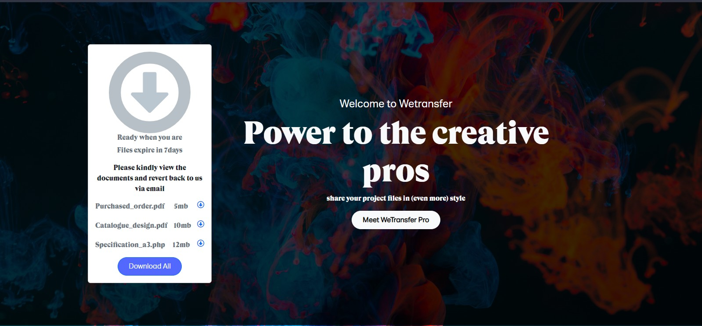

# Wetransfer-clone

 

##
*This is made as sprint to check my delivery speed as regarding paid projects i did deliver though yeah but late sha though all were given in bits the bit delivery was due to some external factors such as light and lots more though*